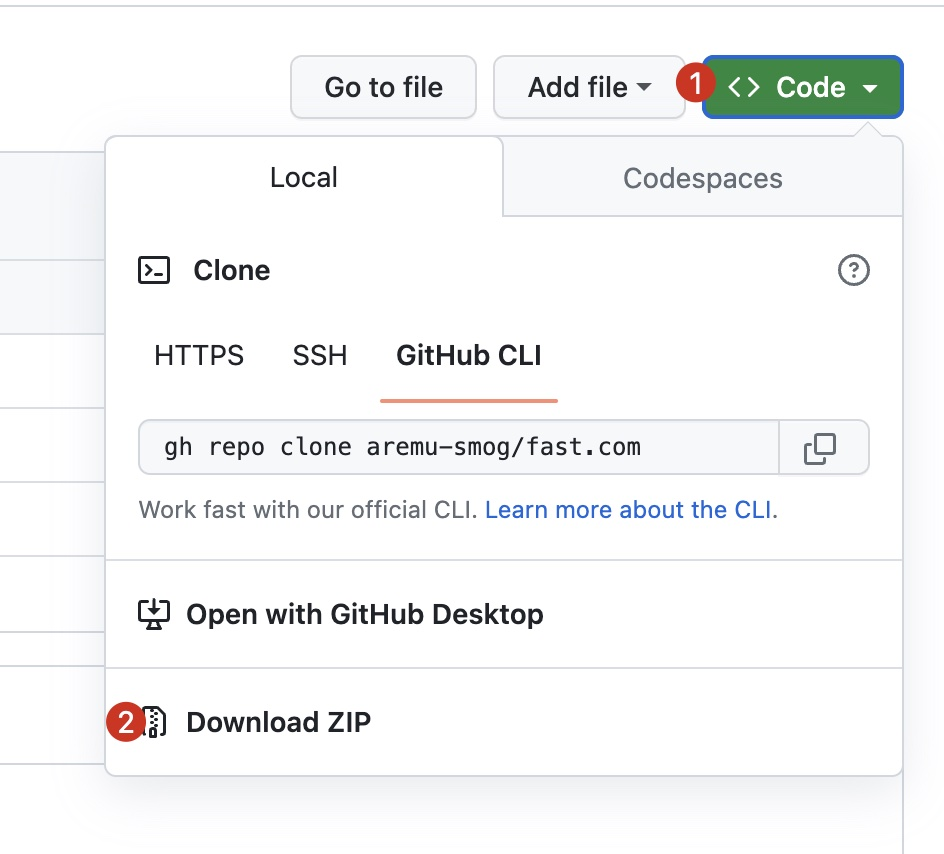
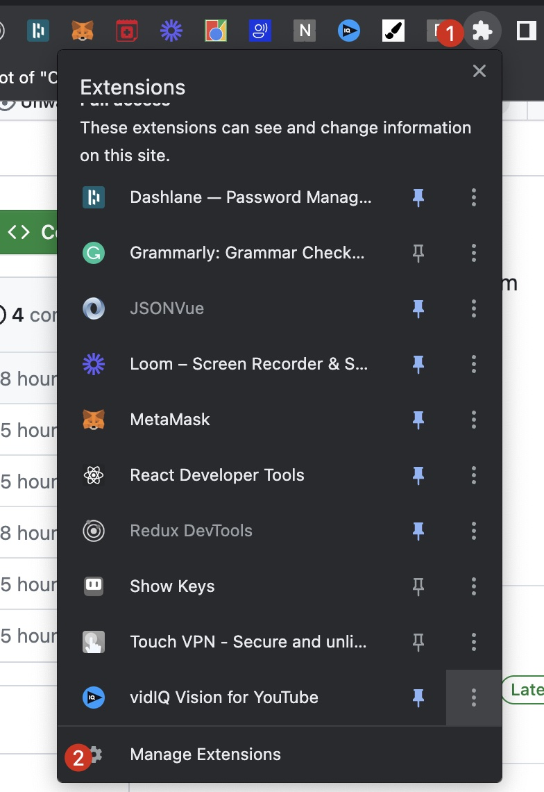
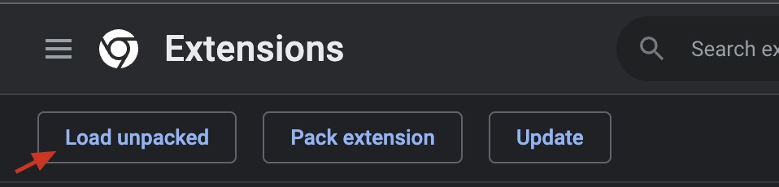
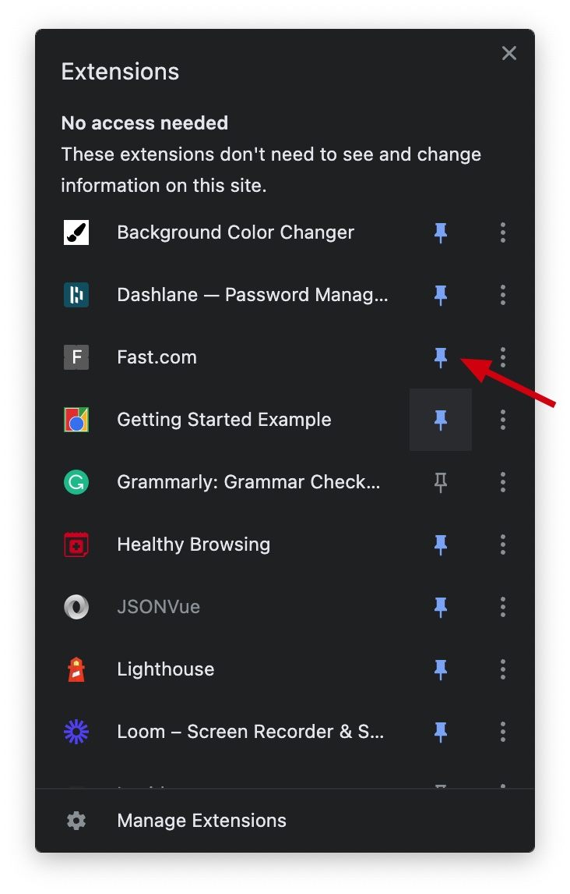

# Overview

A Chrome extension allows a fast access to fast.com built in 5 mins. PS: This project has no affiliation with fast.com.

## Installation

- Download the zip file following the screenshot below

- Unzip the folder

- Click on the extensions icon the browser and select manage extensions or just look at the image below
  
- In the extension interfaces, enable developer mode
  
- Click on Load Unpacked on the Extension Page
  
- Don't forget to pin the extension for easy access

> If you have any issues setting this up, please ping me on [twitter](https://twitter.com/aremu_smog)

## Credits

PS: Don't forget to star the repo. You can also subscribe to my [YouTube channel](https://www.youtube.com/@webboss) where I teach how to do stuffs like [this](https://youtu.be/Es7Ehag46YE).
